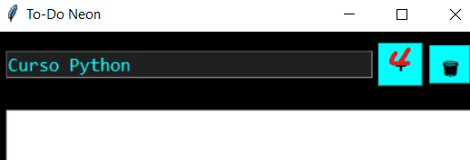
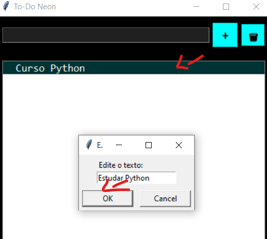
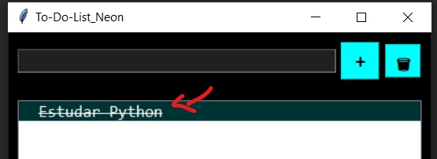
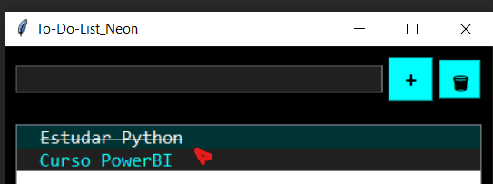
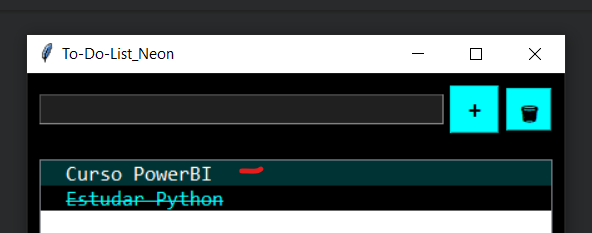
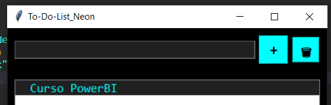

# 🧠 To-Do Neon – Um To-Do List simples, bonito e funcional!

## 💡 Sobre o Projeto

O **To-Do-List Neon** é um aplicativo desktop desenvolvido em **Python + Tkinter**, criado para quem quer uma ferramenta **rápida, leve e prática** para organizar as tarefas do dia a dia.

Em apenas **15 minutos**, a primeira versão foi criada com auxílio da **IA (ChatGPT)** — mostrando que a IA não substitui o programador, mas **potencializa sua produtividade**.

---

## ⚙️ Funcionalidades

✅ Adicionar tarefas rapidamente  
✅ Marcar/desmarcar tarefas como concluídas com um clique  
✅ Editar qualquer tarefa com duplo clique  
✅ Reordenar tarefas arrastando (drag & drop)  
✅ Excluir tarefas com um clique no botão de lixeira  
✅ Interface bacana: fundo preto, texto azul neon e fonte "Consolas"

## Principais ações:

✅ Clique simples → risca a tarefa (marca como concluída).
🖱️ Duplo clique → edita o texto.
↕️ Arrastar e soltar → reordena as tarefas.
---

## 🖥️ Interface

> Aqui vão as capturas de tela para ilustrar cada ação.  
> (adicione seus prints nas seções abaixo 👇)

### ➕ Adicionando uma nova tarefa


---

### ✏️ Editando uma tarefa


---

### ☑️ Marcando como concluída


---

### 🔄 Reordenando tarefas (arrastar e soltar)



---

### 🗑️ Excluindo tarefas



---

## 🚀 Como executar

1. **Clone o repositório**:
    ```bash
    git clone https://github.com/Antonio-Inacio/To-do-List_Neon.git
    cd To-do-List_Neon

2. ```bash
    pip install auto-py-to-exe

3. ```Execute
    auto-py-to-exe

4. **Siga os passos:**
    🧩 Escolha o arquivo: APP_To-do-List-NEON.py
    📦 Marque a opção "One File"
    ▶️ Clique em Convert .py to .exe

✨ Autor
Antonio Marcos
💻 Analista e entusiasta de tecnologia
📚 Formando em Ciência da Computação
📍 Paraisópolis – MG